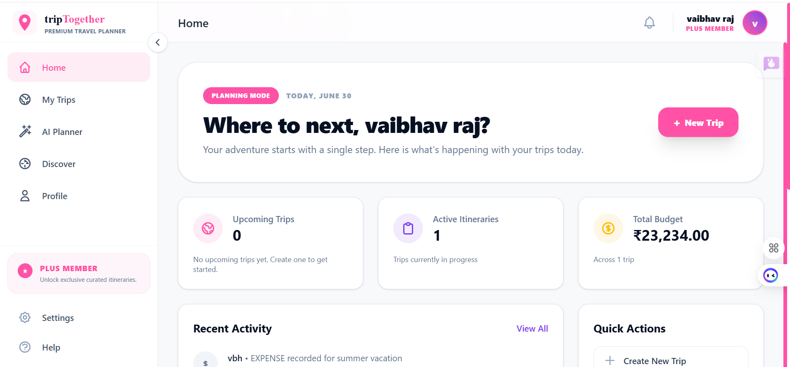
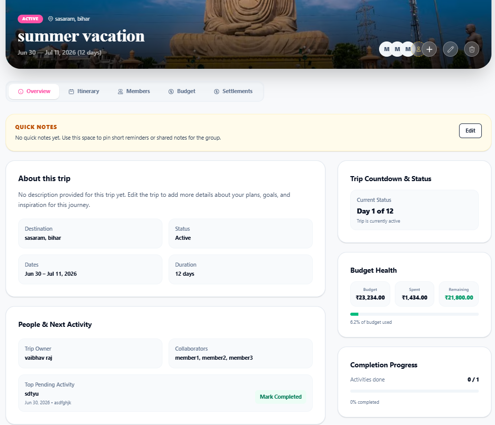
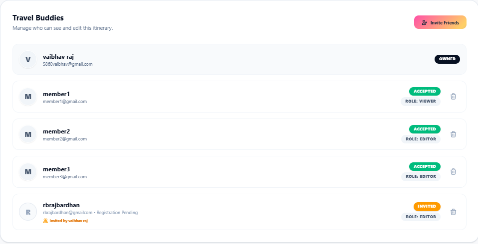
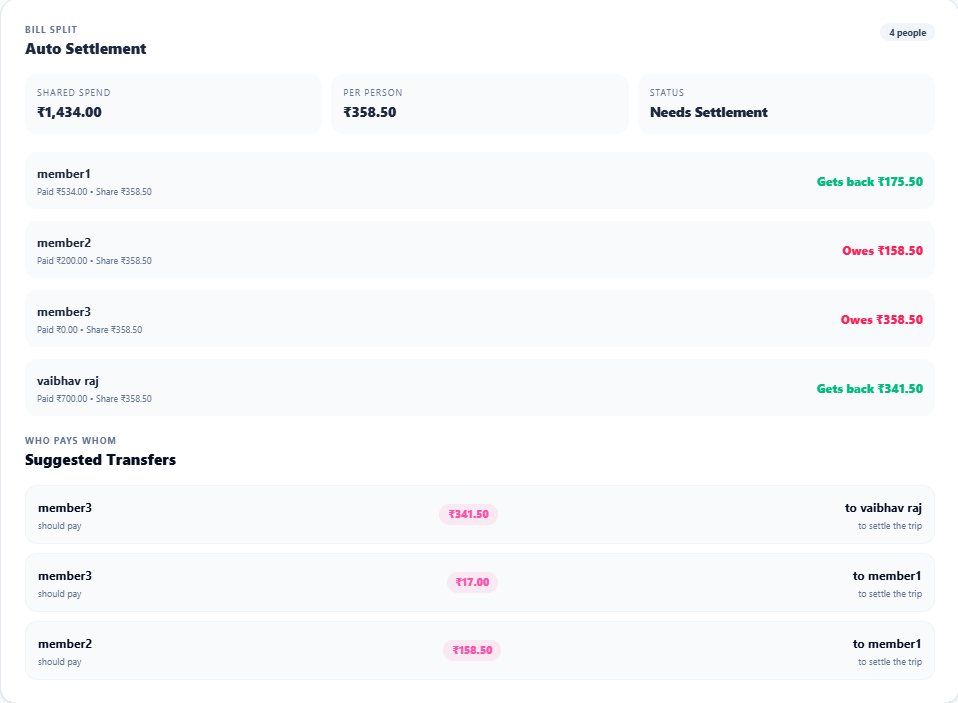
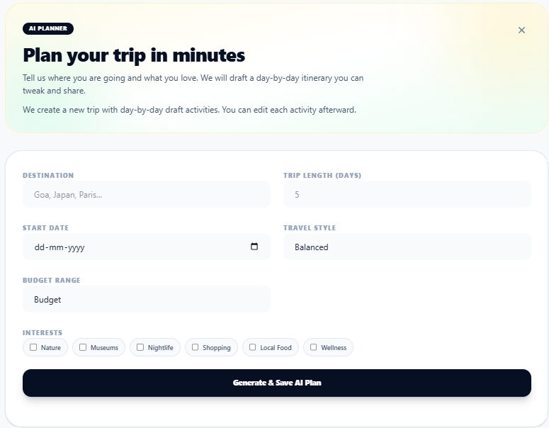

# ✈️ tripTogether — Premium Travel Planner

> Collaborate, plan, and budget your travel itineraries in one beautiful, cohesive dashboard.

`tripTogether` is a state-of-the-art collaborative travel planner designed to streamline your vacation planning process. From day-by-day itinerary generation to auto-calculated budget splits and settlements, it empowers friends to coordinate travel details seamlessly.

---

## 📸 Screenshots

### 🌅 Landing Hero


### 📊 Dashboard & Recommendations


### 🧭 Overview Tab & Quick Notes


### 👥 Travel Buddies & Member Roles


### 💸 Expenses & Settlements Split


### 🤖 AI Planner & Custom Itineraries


### 💵 Membership Pricing


---

## ✨ Features

- **🌐 Live Collaborative Planning**: Invite travel buddies as **Editors** (full create/edit/invite rights) or **Viewers** (read-only).
- **📋 Interactive Itinerary Timeline**: Map out days with custom timelines, locations, and status indicators.
- **💰 Budgeting & Splitting**: Log expenses, specify who paid, select custom spending categories, and view real-time calculations in Rupees (₹).
- **🔄 Auto-Calculated Settlements**: Avoid split-bill headaches with an integrated algorithm that resolves debts (calculates exactly who owes whom and how much).
- **✨ Discover Destination Feed**: Explore curated suggestions (like Amalfi Coast and Santorini) with real-time keyword search.
- **🧠 Explorer Plus AI Planner**: Generate custom day-by-day travel itineraries in seconds using AI.
- **✉️ Fail-Safe Invites**: Safe, integrated SMTP flows using Brevo. If API keys are missing or offline, the app handles actions gracefully in local mode with logs.

---

## 🛠️ Tech Stack

- **Backend**: [Laravel 11](https://laravel.com/) (PHP)
- **Frontend**: [Alpine.js](https://alpinejs.dev/) & [Tailwind CSS](https://tailwindcss.com/)
- **Build System**: [Vite](https://vitejs.dev/)
- **Database**: [PostgreSQL](https://www.postgresql.org/) (via Supabase)
- **Email Services**: [Brevo API](https://www.brevo.com/)

---

## 🚀 Setup & Installation

### Prerequisites
* PHP >= 8.2
* Composer
* Node.js & npm
* PostgreSQL database instance

### 1. Clone & Install Dependencies
```bash
composer install
npm install
```

### 2. Configure Environment Variables
Copy `.env.example` to `.env` and configure your credentials:
```bash
cp .env.example .env
```
Key parameters to update:
```env
DB_CONNECTION=pgsql
DB_HOST=your-database-host
DB_PORT=5432
DB_DATABASE=your-database-name
DB_USERNAME=your-username
DB_PASSWORD=your-password

# Email Integration (Brevo API)
BREVO_API_KEY=your-brevo-api-key
BREVO_SENDER_EMAIL=5860vaibhav@gmail.com
```

### 3. Setup Database Keys and Migrates
```bash
php artisan key:generate
php artisan migrate --seed
```

### 4. Build Assets & Start Dev Servers
Start Vite asset compiler:
```bash
npm run dev
```
In a separate terminal, start the Laravel local server:
```bash
php artisan serve
```
Open [http://localhost:8000](http://localhost:8000) in your browser.

---

## 🧪 Testing Utilities

A debug script is included to quickly test invitations, registration claims, and case-insensitive user lookups:
```bash
php scratch/check_invites.php
```
This utility simulates registration claims and confirms database relational queries execute successfully.
